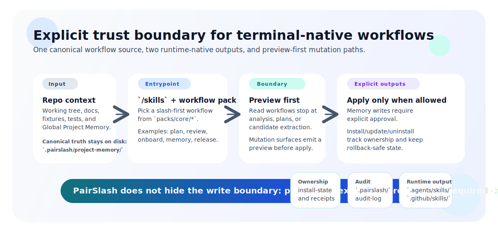

<div align="center">

# PairSlash

**The trust layer for terminal-native AI workflows.**

Re-enter repos with explicit workflows, preview every mutation before it lands,
and keep project memory durable, reviewable, and explicit-write-only.

[](LICENSE)


</div>

---

> **Current support status —** Codex CLI repo/macOS: `degraded` · Copilot CLI user/Linux: `prep` · Windows lanes: `prep`.
> PairSlash is early-stage and honest about it. See [compatibility matrix](docs/compatibility/compatibility-matrix.md) for exact lane details.
>
> **Current stage:**
> PairSlash is currently at Phase 3.5 business validation on top of a technically shipped Phase 4 installability substrate with additional Phase 5/6 hardening in the repo.
> Public claims stay bounded by the [authoritative program charter](docs/phase-12/authoritative-program-charter.md).

---

## Why PairSlash

AI in the terminal is powerful, but it lacks a trust boundary.
Context disappears between sessions. Memory writes happen silently.
There is no way to preview what will change before it changes.

PairSlash exists for that gap.

- **Explicit workflows** — Every workflow declares its contracts: what it reads, what it writes, how it fails. Nothing runs in the background.
- **Preview-first mutations** — Every install, update, or memory write shows a preview diff before apply. You see exactly what will change. Don't like it? Cancel.
- **Global Project Memory** — Durable project truth that lives in `.pairslash/project-memory/` as structured YAML files. Reviewable in git, schema-driven, and only writable through one explicit workflow with preview, acceptance, and audit trail.

PairSlash supports exactly two runtimes: **Codex CLI** and **GitHub Copilot CLI**.
`/skills` is the canonical front door on both.

---

## How it works

<p align="center">
  
</p>

```
Repo context + Global Memory  →  /skills  →  Preview boundary  →  Explicit output
         ↑                           ↑              ↑                     ↑
   .pairslash/              Pick a workflow    See the diff         Accept or cancel.
   project-memory/          from packs/core    before it lands.     Audit trail logged.
```

Read workflows (plan, review, onboard) stop at analysis — they never write.
Write-authority workflows (memory-write-global) require preview + explicit acceptance + audit.

---

## What it looks like in practice

**1. Install a workflow and run `/skills`:**

```bash
npm install
npm run pairslash -- doctor --runtime codex --target repo
npm run pairslash -- install pairslash-plan --runtime codex --target repo --apply --yes
```

**2. In your Codex or Copilot session, run `/skills` and select `pairslash-plan`:**

```
> Create a plan for adding input validation to the API layer.
```

**3. Get a structured, contract-driven output:**

```markdown
## Goal
Add input validation to the API layer.

## Constraints
- [from memory: 00-project-charter.yaml] Canonical entrypoint is /skills.
- [from memory: 50-constraints.yaml] Avoid complex PowerShell patterns in Codex context.

## Proposed steps
1. Add validation middleware to src/api/
2. Add schema definitions for each endpoint
3. Update existing route handlers
4. Add regression tests

## Risks
- Drift between validation schema and actual request types.

## Rollback
1. Revert changed files in git.
2. Re-run npm run test to confirm baseline.

## Open questions
- [I assumed] Validation errors return 400, not 422.
```

Every output section is defined by a contract. Facts are sourced from project memory.
Assumptions are explicitly marked as assumptions.

---

## What PairSlash is — and is not

| PairSlash is | PairSlash is not |
| --- | --- |
| A trust layer for terminal-native AI workflows | A generic agent framework |
| Two-runtime scope: Codex CLI + GitHub Copilot CLI | A third-runtime abstraction layer |
| Slash-first with `/skills` as canonical entrypoint | Prompt-mode parity across all surfaces |
| Explicit-write-only Global Project Memory | Hidden background memory writes |
| Preview-first mutations with audit trail | Autopilot that applies changes without intent |

---

## Quick start

**Prerequisites:** Node `>=24.0.0` and npm `11.7.0`.

> **Note:** PairSlash is installed repo-locally from this checkout, not from a package registry.
> `target` determines where skills are installed — `repo` for Codex (`.agents/skills/`), `user` for Copilot (`~/.github/skills/`).

### Codex CLI lane

```bash
npm install
npm run pairslash -- doctor --runtime codex --target repo
npm run pairslash -- preview install pairslash-plan --runtime codex --target repo
npm run pairslash -- install pairslash-plan --runtime codex --target repo --apply --yes
```

### GitHub Copilot CLI lane

> Copilot lanes are currently `prep`, not `stable-tested`. See [lane record](docs/evidence/live-runtime/copilot-cli-user-linux.md).

```bash
npm run pairslash -- doctor --runtime copilot --target user
npm run pairslash -- preview install pairslash-plan --runtime copilot --target user
npm run pairslash -- install pairslash-plan --runtime copilot --target user --apply --yes
```

### First workflow

1. Open your runtime session from the repo root.
2. Run `/skills`.
3. Select `pairslash-plan`.
4. Ask: `Create a repo plan from the current repo state.`

After first success, try `pairslash-onboard-repo` for a full repo profile.

---

## Core workflows

Every workflow declares its class, memory permissions, and failure behavior.

| I want to... | Workflow | Class |
| --- | --- | --- |
| Plan an implementation safely | `pairslash-plan` | read-oriented |
| Review changes against project conventions | `pairslash-review` | read-oriented |
| Re-enter a repo with a structured profile | `pairslash-onboard-repo` | read-oriented |
| Get canonical command suggestions | `pairslash-command-suggest` | read-oriented |
| Extract durable fact candidates | `pairslash-memory-candidate` | candidate-producing |
| Commit durable memory with preview + approval | `pairslash-memory-write-global` | write-authority |
| Audit memory for duplicates and conflicts | `pairslash-memory-audit` | audit-oriented |

**Read-oriented** workflows consume project memory but never mutate it.
**Write-authority** workflows (`pairslash-memory-write-global`) enforce an 11-step pipeline:
validate → duplicate check → conflict check → preview patch → explicit acceptance → write → audit.

Workflow sources live in [`packs/core/`](packs/core/).

---

## Global Project Memory

Project memory is the architectural backbone of PairSlash. It is not "AI remembering things" — it is structured, file-based, schema-driven project truth managed through explicit workflows.

```
.pairslash/
├── project-memory/                          # Authoritative — the source of truth
│   ├── 00-project-charter.yaml
│   ├── 10-stack-profile.yaml
│   ├── 20-commands.yaml
│   ├── 30-glossary.yaml
│   ├── 40-ownership.yaml
│   ├── 50-constraints.yaml
│   ├── 60-architecture-decisions/
│   ├── 70-known-good-patterns/
│   ├── 80-incidents-and-lessons/
│   └── 90-memory-index.yaml
├── task-memory/                             # Longer-lived than a session, not yet authoritative
├── staging/                                 # Pre-promotion validation area
├── sessions/                                # Working state, disposable
└── audit-log/                               # Every write attempt is logged
```

**Rules:**
- Only `pairslash-memory-write-global` can write to `project-memory/`.
- No hidden writes. No silent promotion. No background mutation.
- Every write shows a preview patch and requires explicit acceptance.
- Every write (accepted or rejected) is logged in `audit-log/`.
- Memory files are normal YAML — reviewable with `git diff`, mergeable in PRs.

---

## Current support reality

PairSlash uses strict, evidence-based support labels. No label is used without matching evidence.

| Runtime | Target | OS | Support level | Meaning |
| --- | --- | --- | --- | --- |
| Codex CLI | `repo` | macOS | `degraded` | Real runtime evidence exists, but canonical `/skills` capture is partial |
| GitHub Copilot CLI | `user` | Linux | `prep` | Deterministic coverage exists, live verification not yet recorded |
| Codex CLI | `repo` | Windows | `prep` | Compat-lab coverage exists, live install evidence pending |
| GitHub Copilot CLI | `user` | Windows | `prep` | Compat-lab coverage exists, live install evidence pending |

**Known issues:**
- Copilot direct invocation with `-p` / `--prompt` is `blocked` — use `/skills`.
- Windows lanes need live install evidence before stronger claims.
- Complex PowerShell flows in Codex read-only sandbox remain `degraded`.

Full details: [compatibility matrix](docs/compatibility/compatibility-matrix.md) · [lane evidence records](docs/evidence/live-runtime/)

---

## When things go wrong

Run doctor first, then file with evidence:

```bash
# Diagnose
npm run pairslash -- doctor --runtime codex --target repo

# Capture a debug bundle
npm run pairslash -- debug --latest --runtime codex --bundle --format text

# Full support trace
npm run pairslash -- trace export --session <session-id> --runtime codex \
  --support-bundle --include-doctor --format text
```

**Issue templates:**

| Problem | Template |
| --- | --- |
| Install or lifecycle bug | [install-bug.md](.github/ISSUE_TEMPLATE/install-bug.md) |
| Runtime mismatch | [runtime-mismatch.md](.github/ISSUE_TEMPLATE/runtime-mismatch.md) |
| Workflow bug | [workflow-bug.md](.github/ISSUE_TEMPLATE/workflow-bug.md) |
| Memory trust bug | [memory-bug.md](.github/ISSUE_TEMPLATE/memory-bug.md) |
| Pack request | [pack-request.yml](.github/ISSUE_TEMPLATE/pack-request.yml) |
| Docs problem | [docs-problem.yml](.github/ISSUE_TEMPLATE/docs-problem.yml) |

See also: [troubleshooting guide](docs/workflows/phase-4-doctor-troubleshooting.md) · [reporting guide](docs/reporting.md)

---

## Project architecture

PairSlash is an npm workspace monorepo with layered separation of concerns.

```
pairslash/
├── packages/
│   ├── core/                    # Shared logic
│   │   ├── spec-core/           # Schema registry and validation (Valibot)
│   │   ├── contract-engine/     # Workflow output contract validation
│   │   ├── policy-engine/       # Policy rule enforcement
│   │   └── memory-engine/       # YAML memory with conflict detection + audit
│   ├── runtimes/
│   │   ├── codex/               # Codex CLI adapter + compiler
│   │   └── copilot/             # Copilot CLI adapter + compiler
│   └── tools/
│       ├── cli/                 # Main CLI entrypoint
│       ├── installer/           # Preview-first install/update/uninstall
│       ├── doctor/              # Environment diagnostics
│       ├── compat-lab/          # Compatibility testing with fixtures
│       ├── lint-bridge/         # Lint and boundary validation
│       └── trace/               # Session logging and debug bundles
├── packs/
│   └── core/                    # 7 core workflow packs (source of truth)
├── docs/                        # Architecture, compatibility, evidence, support
├── tests/                       # Fixtures, goldens, contracts, policy checks
└── .pairslash/                  # Global Project Memory and audit artifacts
```

One canonical workflow source → two runtime-specific outputs.
The spec and contract layers are shared; only the compilers and adapters diverge per runtime.

---

## Development

```bash
npm install                    # Install workspace dependencies
npm run lint                   # Lint gate (includes boundary checks)
npm run test                   # Unit and regression tests
npm run test:acceptance        # Acceptance gates
npm run test:release           # Release readiness validation
npm run test:compat            # Compat-lab fixture tests
```

See [CONTRIBUTING.md](CONTRIBUTING.md) for contributor lanes, PR expectations, and issue routing.

---

## Resources

| Resource | Link |
| --- | --- |
| Docs index | [docs/README.md](docs/README.md) |
| Onboarding path | [docs/phase-9/onboarding-path.md](docs/phase-9/onboarding-path.md) |
| Program charter | [docs/phase-12/authoritative-program-charter.md](docs/phase-12/authoritative-program-charter.md) |
| Compatibility matrix | [docs/compatibility/compatibility-matrix.md](docs/compatibility/compatibility-matrix.md) |
| Public claim policy | [docs/releases/public-claim-policy.md](docs/releases/public-claim-policy.md) |
| Reporting guide | [docs/reporting.md](docs/reporting.md) |
| Examples | [docs/examples/README.md](docs/examples/README.md) |
| Security policy | [SECURITY.md](SECURITY.md) |
| Contributor guide | [CONTRIBUTING.md](CONTRIBUTING.md) |

---

## License

[Apache-2.0](LICENSE)

PairSlash is open source. The current supported install path is repo-local from this checkout.
PairSlash is not currently published to any package registry.
See [legal-packaging-status.md](docs/releases/legal-packaging-status.md) for details.
